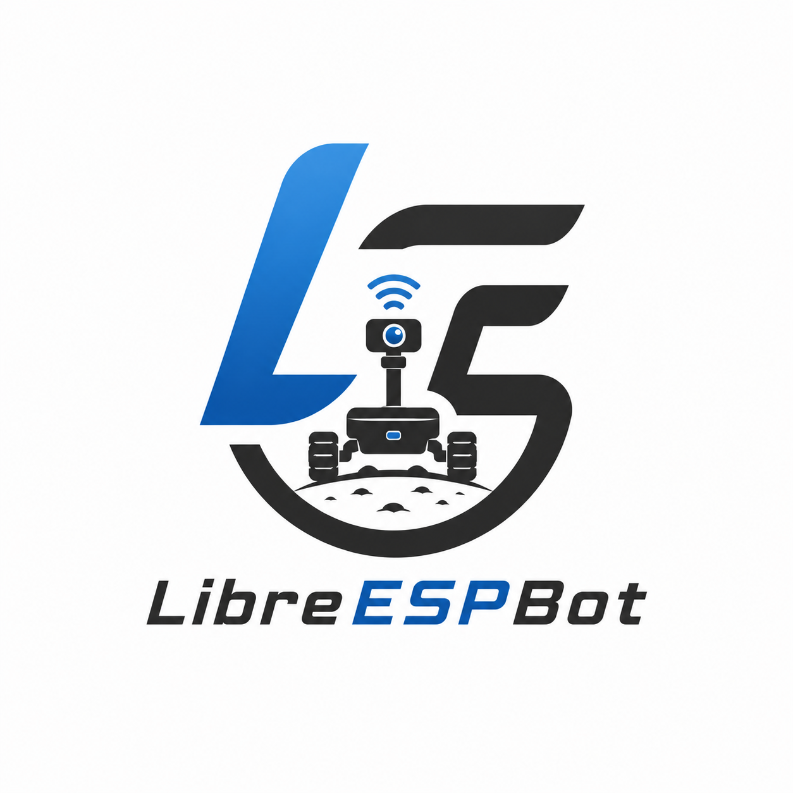
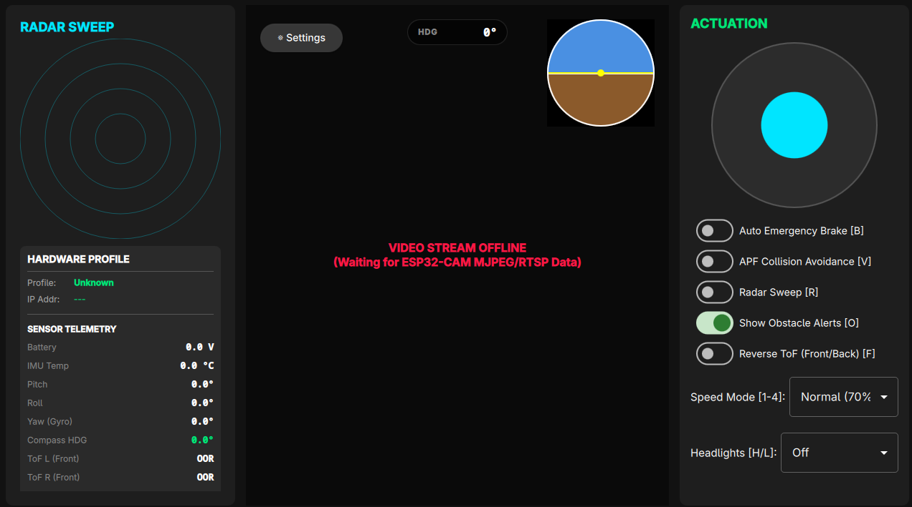

<div align="center">
  
</div>

# ESP32 Multi-Sensor Rover & LibreESPBot

Welcome to the **ESP32 Rover Platform** monorepo! This repository houses a production-grade, highly modular robotics platform and its cross-platform Qt 6 controller application.

This project transitioned from a simple legacy ESP8266 Wi-Fi RC car into an advanced, low-latency, and autonomous-capable embedded system.

---

## Monorepo Architecture

The workspace is organized as a unified monorepo encompassing the embedded targets, cross-platform LibreESPBot, hardware schematics, and automated continuous deployment workflows.

```text
esp32-rover-platform/
├── .github/workflows/          # Automated GitHub Actions for Firmware & Qt 6 CI/CD
├── docs/                       # Comprehensive System Documentation
│   ├── architecture.md         # System design & hardware polymorphism
│   ├── protocol.md             # UDP binary C-struct definitions
│   └── setup_guide.md          # PlatformIO & Qt 6 build instructions
├── archive/
│   └── esp8266/                # [ARCHIVED] Legacy ESP8266 Wi-Fi RC Car implementation
├── firmware/
│   ├── main_controller/        # Primary ESP32 Node (Kinematics, Sensors, Fusion)
│   │   ├── include/            # Configs, Types, and Headers
│   │   └── src/                # Implementation: Core, Drivers, Control, Protocol
│   └── cam_streamer/           # Secondary ESP32-CAM Node (RTSP/MJPEG Streamer)
├── software/
│   └── controller_app/         # Cross-Platform Qt 6 / QML LibreESPBot
│       ├── android/            # Android APK build configurations
│       ├── qml/                # Qt Quick UI (Radar, Horizon, Joysticks)
│       └── src/                # C++ Backend (mDNS Discovery, UDP Telemetry)
├── hardware/                   # (Planned) Schematics & CAD files
└── scripts/                    # Utility scripts
```

---

## Documentation Links

For detailed deep-dives into the architecture, communication protocol, and build instructions, please refer to the dedicated documentation files:

- [System Architecture](docs/architecture.md): Overview of the firmware modularity and Qt 6 application structure.
- [Communication Protocol](docs/protocol.md): Definitions for the zero-copy binary telemetry and command packets, including CRC-16-CCITT validation.
- [Setup & Developer Guide](docs/setup_guide.md): Instructions on how to compile the ESP32 PlatformIO environments and the Qt 6 CMake project.
- [User Manual](docs/user_manual.md): Comprehensive guide on UI features, keyboard shortcuts, and control mappings.

---

## Embedded Firmware (`firmware/main_controller`)

Powered by the **PlatformIO** and **Arduino Core**, the ESP32 handles high-speed sensor fusion and kinematics calculation.

### Key Features
- **Polymorphic Hardware Support**: Compile-time static specialization across various IMUs (`MPU6050`, `BMI160`) and compasses (`QMC5883L`, `HMC5883L`, `LIS3MDL`). Zero dynamic overhead.
- **Sensor Fusion**: `MahonyAHRS` 9-DoF orientation estimation filter computes real-time pitch, roll, and yaw angles.
- **Obstacle Avoidance (ToF)**: Dual `GYVL53L0XV2` sensors sweep via a servo. Implements **Automatic Emergency Braking (AEB)** using active short-braking on the `TB6612FNG` motor driver if obstacles are detected under a given threshold.
- **Zero-Copy UDP Telemetry**: Operating at 50 Hz, exchanging packed binary C-structs validated using `CRC-16-CCITT` over UDP.

### Building Firmware
Navigate to `firmware/main_controller/` and use PlatformIO:
```bash
pio run -e rover_v2_mpu6050_qmc5883l_tb6612
pio run -e firmware_sensor_calibration
```

---

## LibreESPBot (`software/controller_app`)

A high-performance controller application written in **C++ and QML (Qt 6)**. It utilizes a highly responsive multithreaded architecture.

<div align="center">
  
  <p><i>The LibreESPBot in its disconnected UI state, displaying the Cybernetic HUD.</i></p>
</div>

### Key Features
- **Cross-Platform**: Deployable to Linux (AppImage), Windows (Standalone ZIP), and Android (Universal APK).
- **Network Stack**: 
  - `DiscoveryWorker`: Listens for mDNS (`_roverctrl._udp.local`) and dynamically binds to the ESP32 IP.
  - `TelemetryClient` & `CommandEmitter`: Processes 50Hz bi-directional UDP telemetry.
- **Cybernetic HUD**:
  - `PolarRadarCanvas`: Converts polar Time-of-Flight distances into a 2D Cartesian radar plot, mapping close objects in red and safe objects in green.
  - `ArtificialHorizon`: Dynamic UI linked to the real-time ESP32 IMU Euler angles.
  - `VirtualJoystick`: Multi-touch joysticks equipped with exponential response curve filtering (`u_exp(v) = sgn(v) * |v|^1.6`).

### Building Software
Requires a **Qt 6.6+** development environment.
```bash
cd software/controller_app
cmake -B build -S . -G Ninja -DCMAKE_BUILD_TYPE=Release
cmake --build build
```

---

## Automated CI/CD Pipeline

Every push to the repository triggers our `.github/workflows/release.yml` multi-platform pipeline which automatically builds:
1. **PlatformIO Firmware Matrices** (Merging `.bin` files via esptool).
2. **Linux AppImage** (Desktop app).
3. **Windows ZIP** (Desktop app).
4. **Android APK** (Mobile app).

---

## Archived Implementations
The initial prototype built on the **ESP8266 NodeMCU** board featuring an HTTP server and L298N interface has been officially archived to `archive/esp8266/`.

## License
This project is open-source and available under the standard MIT License.
